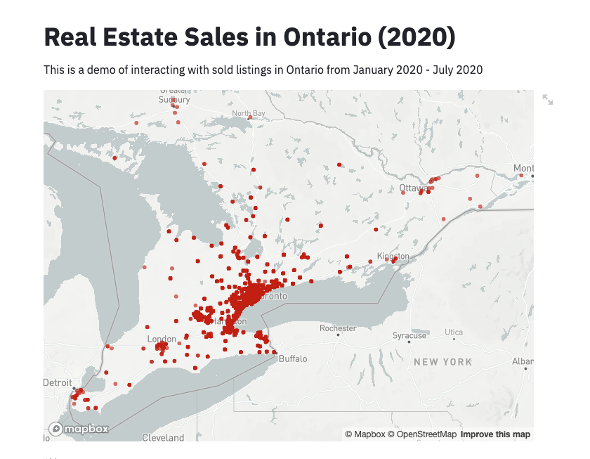
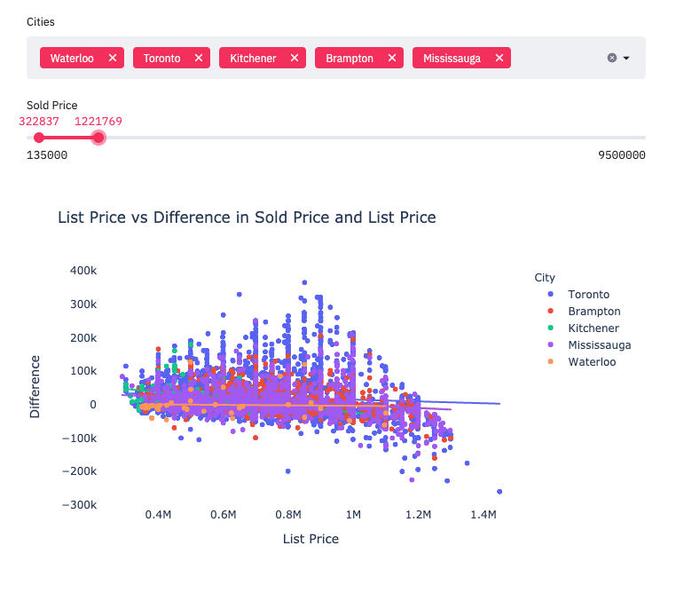

# 2020 Real Estate Sale Data Visualizations (Ontario, Canada)

## Config

make sure you have streamlit plotly and pandas installed ```pip install -r requirements.txt```

Run ``` streamlit run real_estate.py``` to start the website.





