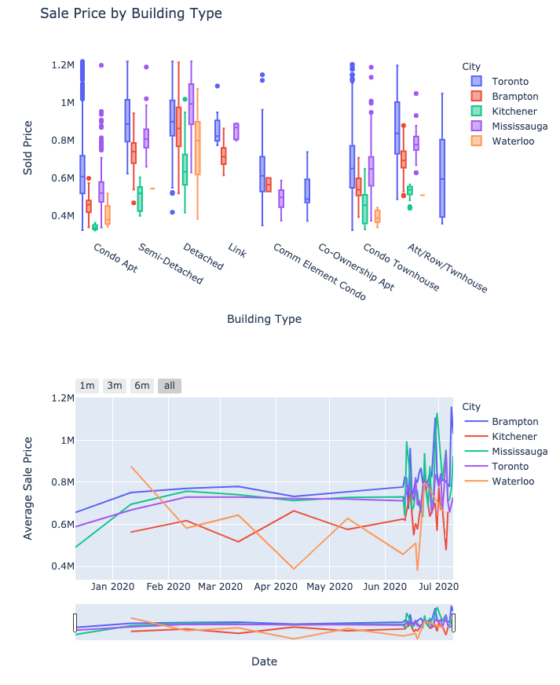
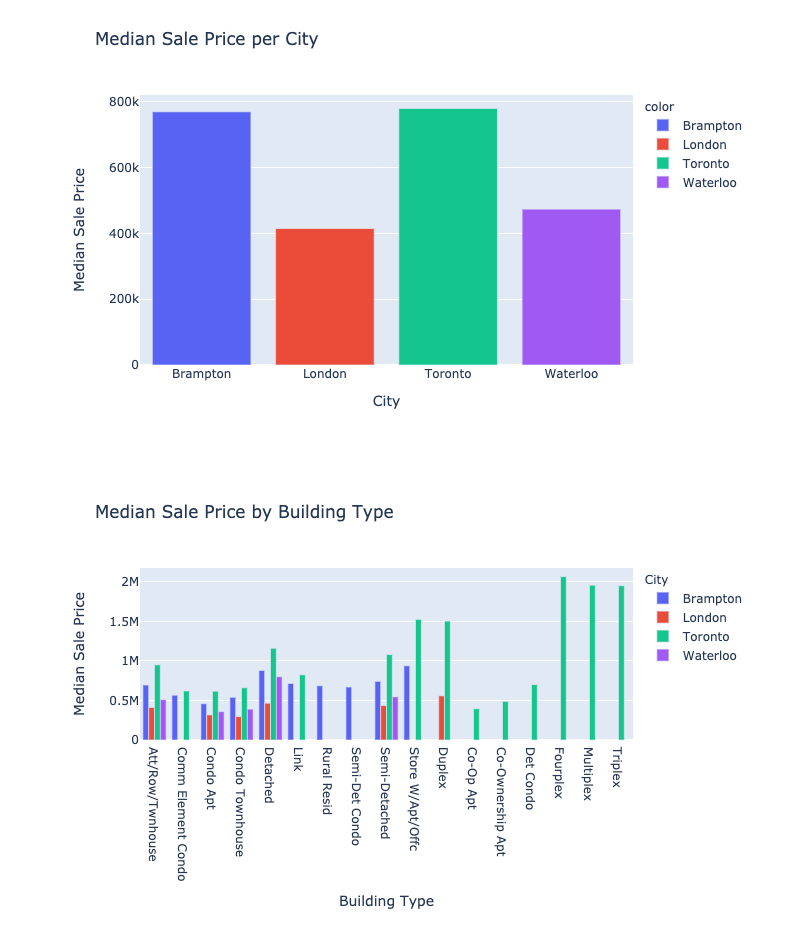
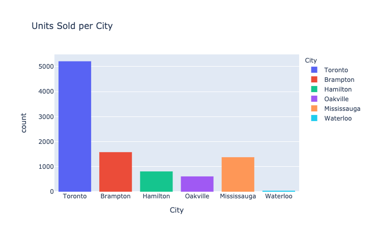

# 2020 Real Estate Sale Data Visualizations (Ontario, Canada)

Interactive plots in python of data found on various websites using selenium and beautifulsoup web scraping.








## Config

make sure you have streamlit plotly and pandas installed ```pip install -r requirements.txt```

Run ``` streamlit run real_estate.py``` to start the website.
